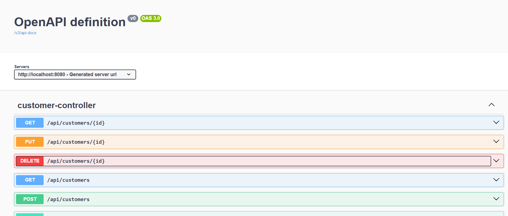
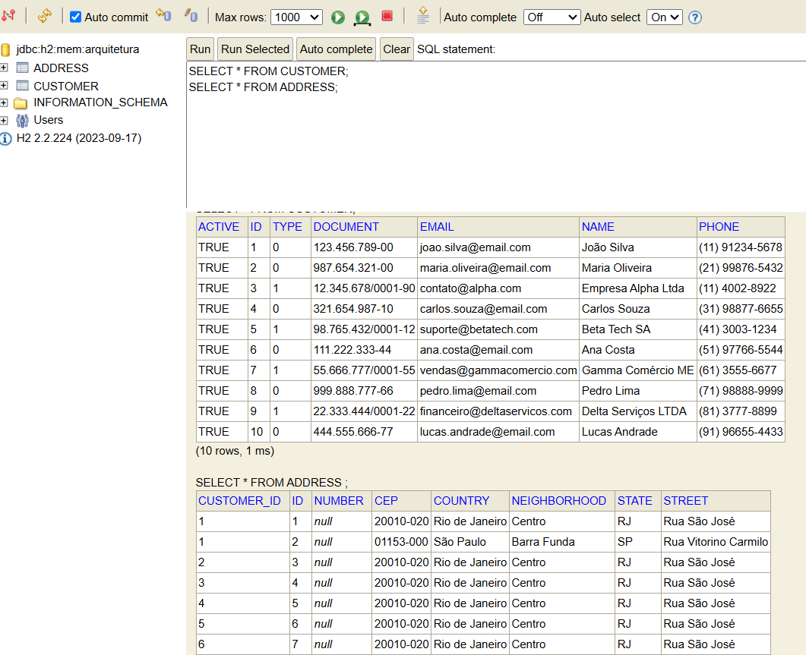

# infnet-gestao-de-clientes-de-varejo
Gestão de Clientes de Varejo para Pequenas Empresas.

#### Objetivo
Projeto para a disciplina de Arquitetura de Plataformas em Java.

#### Descrição do Projeto
Projeto construído em Spring Boot e Java 17.

Permite realizar o gerenciamento de clientes de lojas de varejo através de APIs REST.

#### Usando as APIs
- Acesse o http://localhost:8080/swagger-ui/index.html
- Informe usuário e senha
	- Usuário: admin
	- Senha: adminPass
E execute as collections desejadas.

#### Acessando o Banco de Dados embarcado
H2 é um sistema de gerenciamento de banco de dados relacional leve, de código aberto e na memória, escrito em Java, comumente usado com Spring Boot para desenvolvimento e testes.

Acesse o http://localhost:8080/h2-console
- JDBC URL: dbc:h2:mem:arquitetura
- Usuário: sa
- Senha: Em branco - não preencher

#### Stack de Tecnologias
- Java 17
- Spring Boot 3.3.4
- Spring Web: Para a criação dos controllers REST.
- Spring Data JPA: Para a camada de persistência de dados.
- Hibernate: Implementação do JPA para mapeamento Objeto-Relacional (ORM).
- H2 Database: Banco de dados relacional em memória para desenvolvimento.
- Spring Boot Validation: Para validação declarativa dos DTOs e entidades.
- Spring Security: Para controle de acessos
- Maven: Para gerenciamento de dependências e build do projeto.

#### Features implementadas

* Feature 1 
   - Organização do pacote
   - Criação da classe de domínio
   - Classe de serviço
   - Interfaces
   - Data Loader - Leitura de arquivo
   - Injeção de dependência
   - Criação de endpoints (Rest Controller)

- Feature 2
   - Classes abstratas e herança
   - Incrementar atributos das classes de domínios
   - Criação de todos os endpoints CRUD e inativar cliente
   - CRUD para os vendedores
   
- Feature 3
   - Camada de persistência com Spring Data JPA
   - Habilitando Feign Client para serviços externos
   - Validação de dados de entrada com anotações
   - Uso de Response Entity para tratar componentes de resposta ao cliente
   - Tratamento de Exceções
   
- Feature 4
   - Centralização de erros e tratamento de exceções com @ControllerAdvice
   - Criação de relacionamentos entre clientes e endereços
   	- Implementar relacionamentos (OneToMany, ManyToMany, ManyToOne, OneToOne)
   	- Consulta complexas
   		- Busca por CPF ou CNPJ dos clients
   		- Busca por clientes ativos
   		- Busca por tipos de clientes ordenando por Id
   		
- Feature 5
	- DTOS
		- Um DTO (Data Transfer Object) é um objeto usado para transferir dados entre diferentes camadas da aplicação, especialmente entre o backend e o frontend. Ele serve para encapsular os dados necessários, evitando a exposição de informações sensíveis ou desnecessárias da entidade do banco de dados.
   	- Segurança
   		- Spring Security
   	- Swagger UI
   		- Documentação das APIs através das bibliotecas do Spring Doc
      

